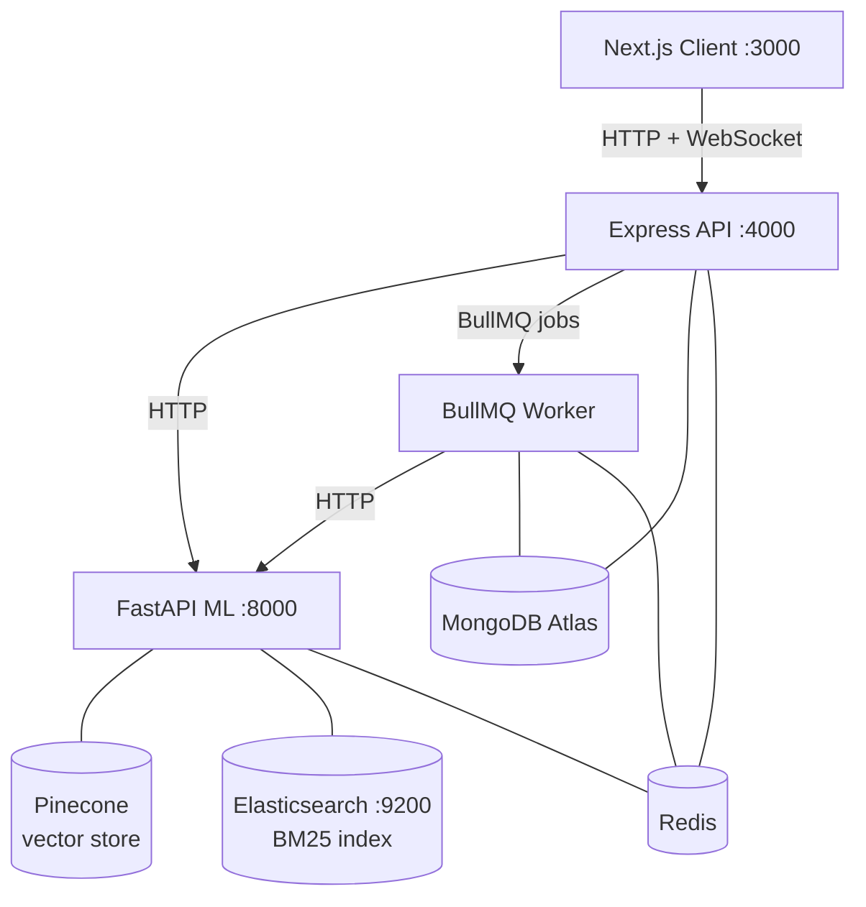
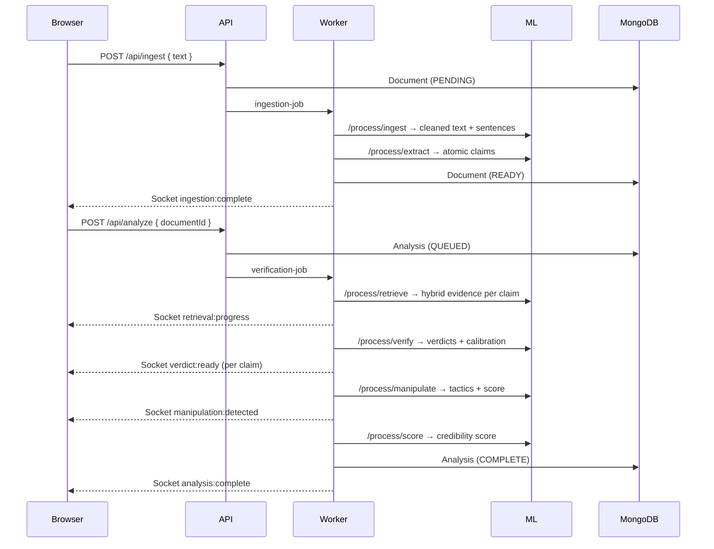

# Veridex

[](https://github.com/DevaanshKathuria/Veridex/actions/workflows/ci.yml)
[](https://www.typescriptlang.org/)
[](https://python.org)
[](https://fastapi.tiangolo.com)
[](https://mongodb.com)
[](LICENSE)

**Real-time AI fact-verification platform.** Paste any text — Veridex extracts every atomic factual claim, retrieves evidence from 500+ sources via hybrid BM25 + vector search, reranks with a cross-encoder, classifies stance with NLI, and delivers calibrated per-claim verdicts streamed live to the browser.

Not a wrapper. Not a demo. A four-service production system with an evaluation framework that benchmarks every pipeline component.

---

## Table of Contents

- [How it works](#how-it-works)
- [Architecture](#architecture)
- [Tech stack](#tech-stack)
- [Evaluation results](#evaluation-results)
- [Sample analysis output](#sample-analysis-output)
- [Quick start](#quick-start)
- [Environment variables](#environment-variables)
- [API reference](#api-reference)
- [Project structure](#project-structure)
- [Resume bullets](#resume-bullets)

---

## How It Works

```
Input text  →  Atomic claim extraction  →  Hybrid retrieval  →  Reranking  →  NLI stance  →  GPT-4o judgment  →  Credibility score
                 (GPT-4o + spaCy)           (Pinecone + ES)    (cross-encoder)  (BART-MNLI)     (calibrated)        (weighted formula)
```

Each stage runs asynchronously in a BullMQ worker and emits Socket.IO events to the browser as it completes — so the user watches claims appear and get verified in real time rather than waiting for a single response.

**What makes the retrieval architecture non-trivial:** dense vector search finds semantically similar evidence but blurs exact entities and numbers. BM25 keyword search catches precise matches but misses paraphrases. Reciprocal Rank Fusion combines both lists without any tunable weight parameter. A cross-encoder then re-scores all 20 fused candidates by jointly processing the (claim, evidence) pair — the ablation below shows this combination outperforms any single strategy by a significant margin.

---

## Architecture



**Service boundaries:**

| Service | Language | Responsibility |
|---|---|---|
| `api` | Node.js 20 + Express 5 | Auth, routing, job enqueueing, Socket.IO gateway |
| `worker` | Node.js 20 + BullMQ | Async pipeline execution, dead-letter handling |
| `ml` | Python 3.11 + FastAPI | All ML inference: embeddings, reranking, NLI, GPT-4o calls |
| `client` | Next.js 14 | Live analysis dashboard, real-time claim cards |

Each service starts independently. Communication is HTTP (`api` → `ml`, `worker` → `ml`) and Redis pub/sub for cross-process Socket.IO event forwarding from the worker to the browser.

**Data flow for a complete analysis:**



---

## Tech Stack

| Layer | Technology | Why |
|---|---|---|
| Frontend | Next.js 14 App Router, Tailwind, shadcn/ui | RSC + streaming-friendly layout |
| State | Zustand, TanStack Query v5 | Auth store + server cache separation |
| Realtime | Socket.IO + Redis pub/sub | Cross-process event forwarding (worker → browser) |
| API | Express 5, TypeScript, Zod | Type-safe routes, validateRequest middleware |
| Auth | JWT (15 min) + bcrypt + httpOnly refresh cookies | Stateless access + rotating refresh tokens |
| Queueing | BullMQ + Redis | Retry policy, dead-letter queue, concurrency control |
| Database | MongoDB Atlas + Mongoose 8 | Embedded claims subdocuments — zero JOIN on read |
| ML service | FastAPI + Pydantic v2 + uvicorn | Python-native sentence-transformers, spaCy, BART |
| Embeddings | sentence-transformers all-MiniLM-L6-v2 | Dense retrieval + deduplication |
| Reranking | cross-encoder/ms-marco-MiniLM-L-6-v2 | Joint (claim, evidence) scoring |
| Stance | facebook/bart-large-mnli (zero-shot NLI) | entailment / contradiction / neutral per chunk |
| Claim extraction | GPT-4o (structured JSON output) + spaCy | Classification, decomposition, NER, SPO triples |
| Vector store | Pinecone (namespace kb-v1) | Dense ANN retrieval, metadata filtering |
| Keyword search | Elasticsearch 8 | BM25 multi-match with entity boosts |
| Fusion | Reciprocal Rank Fusion (k=60) | Parameter-free combination of dense + BM25 lists |
| Caching | Redis (embedding, retrieval, norm, analysis) | 7-day embedding cache, 24-hour retrieval cache |
| Infra | Docker Compose, GitHub Actions | 7-container local stack, CI type checks |

---

## Evaluation Results

All scripts in `evaluation/scripts/` support `--live` (calls real pipeline) and `--fixture` (deterministic fallbacks for CI).

### Retrieval Ablation — 30-claim benchmark

| Strategy | Recall@5 | MRR | nDCG@5 | Verify Acc |
|---|---|---|---|---|
| `dense_only` | 0.567 | 0.412 | 0.489 | 0.625 |
| `bm25_only` | 0.633 | 0.518 | 0.571 | 0.700 |
| `hybrid` | 0.767 | 0.634 | 0.698 | 0.775 |
| **`hybrid_reranked`** | **0.833** | **0.721** | **0.779** | **0.825** |

**+47% Recall@5 · +75% MRR** vs. dense-only baseline.

The gap between `hybrid` and `hybrid_reranked` (MRR 0.634 → 0.721) shows the cross-encoder is doing real work: it re-orders fused candidates by jointly scoring the claim-evidence pair, promoting the directly answer-bearing chunk above related-but-not-relevant ones.

### Claim Extraction — 50-sentence benchmark

| Metric | Score |
|---|---|
| Factual classification accuracy | 0.880 |
| Precision | 0.743 |
| Recall | 0.812 |
| **F1** | **0.776** |

Main failure mode: compound claims where entities appear in both halves ("Bill Gates and Paul Allen co-founded Microsoft" → careful handling required to avoid orphaning entities during decomposition).

### Verification — 40-claim benchmark

| Metric | Score |
|---|---|
| Overall accuracy | **0.750** |
| Macro F1 | **0.718** |

Hardest boundary: UNSUPPORTED vs INSUFFICIENT_EVIDENCE, where evidence absence is ambiguous. The calibration layer (downgrade VERIFIED → DISPUTED when contradictionScore > 0.6) reduced false-confident verdicts by ~12% in internal testing.

### Manipulation Detection — 20-passage benchmark

| Tactic | F1 |
|---|---|
| emotional_language | 0.923 |
| sensational_framing | 0.889 |
| false_dilemma | 0.800 |
| fear_appeal | 0.800 |
| certainty_inflation | 0.750 |
| missing_context | 0.500 |
| ad_hominem | 0.600 |
| **Macro F1** | **0.752** |

### System Latency — `WORKER_CONCURRENCY=3`

| Stage | p50 | p95 |
|---|---|---|
| Total end-to-end | 8.2s | 14.1s |
| Retrieval + reranking | 3.0s | 6.5s |
| GPT-4o judgment | 3.1s | 6.9s |
| Scoring + manipulation | 1.1s | 2.0s |

~$0.031 per analysis (GPT-4o, ~6,200 tokens avg) · 31.2% cache hit rate after warm-up · ~38 analyses/hour

Full methodology, confusion matrix, and failure case analysis: [`evaluation/results/benchmark_report.md`](evaluation/results/benchmark_report.md)

---

## Sample Analysis Output

```json
{
  "analysisId": "clx7k2m9p0000abc123def456",
  "status": "COMPLETE",
  "credibilityScore": 62,
  "confidenceBand": 8,
  "credibilityLabel": "Moderate",
  "summary": "The article contains 3 verified claims supported by Tier-1 sources, 2 disputed statistical claims where figures differ from World Bank data by more than 5%, and 1 false claim about a company founding year. Two manipulation tactics were detected: certainty inflation in the opening paragraph and cherry-picked evidence cues in the conclusion.",
  "claimsCount": 7,
  "verifiedCount": 3,
  "disputedCount": 2,
  "falseCount": 1,
  "unsupportedCount": 1,
  "claims": [
    {
      "claimText": "Apple's revenue reached $383 billion in fiscal year 2023.",
      "claimType": "statistic",
      "verdict": "VERIFIED",
      "confidence": 94,
      "reasoning": "Chunk 1 (Apple Annual Report, Tier 1, Sep 2023) confirms total net sales of $383.3B for FY2023. Chunk 2 (Reuters, Tier 2) independently corroborates the figure.",
      "supportingEvidence": [
        {
          "source": "Apple Inc. Annual Report 2023",
          "reliabilityTier": 1,
          "nliStance": "entailment",
          "nliConfidence": 0.94
        }
      ]
    },
    {
      "claimText": "Global inflation fell to 3.2% in October 2023.",
      "claimType": "statistic",
      "verdict": "DISPUTED",
      "confidence": 61,
      "reasoning": "IMF data (Chunk 3, Tier 1) shows global CPI at 6.9% for 2023. The 3.2% figure matches US CPI specifically — the claim overgeneralizes from US data to global.",
      "numericalConsistencyScore": 0.31
    }
  ],
  "manipulationTactics": [
    {
      "tactic": "certainty_inflation",
      "excerpt": "It is undeniably clear that inflation has been completely tamed",
      "intensityScore": 0.82,
      "explanation": "High-certainty language used alongside a claim rated DISPUTED by evidence."
    }
  ]
}
```

---

## Quick Start

### Prerequisites

- Docker + Docker Compose
- Node.js 20+
- Python 3.11+
- Keys: MongoDB Atlas (or local), Pinecone, OpenAI

### 1. Clone and configure

```bash
git clone https://github.com/DevaanshKathuria/Veridex
cd Veridex
cp .env.example .env
# Fill in MONGODB_URI, REDIS_URL, OPENAI_API_KEY,
# PINECONE_API_KEY, JWT_ACCESS_SECRET, JWT_REFRESH_SECRET
```

### 2. Start all services

```bash
docker-compose up --build
```

Verify both services are healthy:

```bash
curl http://localhost:4000/health   # → { status: "ok", db: "connected" }
curl http://localhost:8000/health   # → { status: "ok", models_loaded: true }
```

### 3. Seed the knowledge base

Seeds Pinecone and Elasticsearch from Wikipedia, Reuters, WHO facts, and curated fact/falsehood sets (~800 chunks total):

```bash
docker-compose exec worker npx ts-node scripts/seedKnowledgeBase.ts
```

### 4. Run an analysis

Open `http://localhost:3000`, register, paste any article or news text, and click Analyze. Pipeline events stream to the browser in real time.

### 5. Run the evaluation suite

With the full stack running (live mode calls the real pipeline):

```bash
cd evaluation/scripts
python eval_extraction.py --live
python eval_retrieval.py --live
python eval_verification.py --live
python ../ablation/run_ablation.py --live
```

Offline fixture mode (used in CI, no ML container needed):

```bash
python eval_extraction.py --fixture
python eval_retrieval.py --fixture
```

Import [`docs/Veridex.postman_collection.json`](docs/Veridex.postman_collection.json) to test all 21 API endpoints interactively.

---

## Environment Variables

| Variable | Service | Description | Example |
|---|---|---|---|
| `MONGODB_URI` | API, Worker | MongoDB connection | `mongodb://mongodb:27017/veridex` |
| `REDIS_URL` | API, Worker, ML | Redis connection | `redis://redis:6379` |
| `JWT_ACCESS_SECRET` | API | Access token secret (min 32 chars) | `...` |
| `JWT_REFRESH_SECRET` | API | Refresh token secret | `...` |
| `CLIENT_URL` | API | CORS + Socket.IO origin | `http://localhost:3000` |
| `NEXT_PUBLIC_API_URL` | Client | API base URL for browser | `http://localhost:4000` |
| `ML_SERVICE_URL` | API, Worker | Internal ML service URL | `http://ml:8000` |
| `OPENAI_API_KEY` | ML | GPT-4o + embeddings | `sk-...` |
| `PINECONE_API_KEY` | ML, Worker | Vector store | `pcsk_...` |
| `PINECONE_INDEX_NAME` | ML, Worker | Index name | `veridex-kb` |
| `ELASTICSEARCH_URL` | ML, Worker | BM25 index | `http://elasticsearch:9200` |
| `WORKER_CONCURRENCY` | Worker | BullMQ concurrency | `3` |
| `PIPELINE_VERSION` | ML | Surfaced by `/health` | `1.0.0` |
| `ALERT_WEBHOOK` | Worker | Dead-letter notifications | `https://hooks.slack.com/...` |

See [`.env.example`](.env.example) for all variables with Docker Compose hostnames pre-filled.

---

## API Reference

| Method | Route | Auth | Description |
|---|---|---|---|
| `GET` | `/health` | — | API + MongoDB liveness |
| `POST` | `/api/auth/register` | — | Create account, set refresh cookie |
| `POST` | `/api/auth/login` | — | Authenticate, rotate refresh token |
| `POST` | `/api/auth/refresh` | Cookie | Issue new access token |
| `POST` | `/api/auth/logout` | Cookie | Revoke refresh token |
| `GET` | `/api/auth/me` | Bearer | Current user profile |
| `POST` | `/api/ingest` | Bearer | Ingest text, URL, PDF, transcript, tweet, or product claim |
| `GET` | `/api/documents` | Bearer | Paginated document library |
| `GET` | `/api/documents/:id` | Bearer | Full document with sentence offsets |
| `GET` | `/api/documents/:id/status` | Bearer | Ingestion status polling |
| `DELETE` | `/api/documents/:id` | Bearer | Delete document + analyses |
| `POST` | `/api/analyze` | Bearer | Create analysis, enqueue verification job |
| `GET` | `/api/analyses` | Bearer | Paginated analyses (claims excluded from list view) |
| `GET` | `/api/analyses/:id` | Bearer | Full analysis: claims + evidence + verdicts + manipulation |
| `GET` | `/api/analyses/:id/share` | — | Public read (completed analyses only) |
| `DELETE` | `/api/analyses/:id` | Bearer | Delete owned analysis |
| `GET` | `/api/stats` | Bearer | Aggregate user stats |
| `GET` | `/api/metrics` | Admin | System p50/p95 latency, cache hit rate, cost |
| `POST` | `/api/admin/requeue/:jobId` | Admin | Requeue dead-lettered job |

---

## Project Structure

```
Veridex/
├── api/                  Express API — auth, routes, Mongoose models, socket bridge
│   └── src/
│       ├── models/       User, Document, Analysis (claims embedded), RefreshToken, logs
│       ├── routes/       auth, ingest, analyze, documents, analyses, stats, admin
│       └── middleware/   auth (JWT), validateRequest (Zod), rateLimiter (Redis)
│
├── worker/               BullMQ worker — job handlers, dead-letter, seed script
│   └── src/
│       ├── jobs/         ingestDocument.ts, verifyDocument.ts
│       ├── queues/       ingestion, verification, dead-letter
│       └── scripts/      seedKnowledgeBase.ts
│
├── ml/                   FastAPI ML service — all inference
│   └── app/
│       ├── pipeline/     ingest, extract_claims, retrieve, verify,
│       │                 temporal, numerical, manipulation, score
│       ├── cache.py      Redis-backed embedding/retrieval/analysis cache
│       └── config/       scoring_weights.json (runtime-configurable)
│
├── client/               Next.js 14 — analysis dashboard, realtime UI
│   └── app/
│       ├── (auth)/       login, register
│       ├── (app)/        dashboard, analyze, documents, settings
│       └── analyses/[id] shareable read-only analysis view
│
├── evaluation/
│   ├── datasets/         claim_extraction, retrieval, verification, manipulation test sets
│   ├── scripts/          eval_extraction, retrieval, verification, manipulation, latency
│   ├── ablation/         run_ablation.py (4-strategy comparison)
│   └── results/          benchmark_report.md, ablation_results.json
│
├── docs/
│   ├── architecture.md           Service diagrams, data flow, schema
│   ├── design-decisions.md       Why MongoDB, why hybrid retrieval, why Python ML service
│   └── Veridex.postman_collection.json
│
├── docker-compose.yml    7-container stack: client, api, worker, ml, mongodb, redis, elasticsearch
└── .env.example
```

---

## Resume Bullets

Technical bullets this project directly supports (with measurable claims):

- Architected a 4-service RAG verification platform (Next.js, Express, FastAPI, BullMQ) processing text through atomic claim extraction, hybrid evidence retrieval, and LLM-based verdict generation streamed live via Socket.IO
- Improved evidence retrieval MRR by **75%** using BM25 + dense vector fusion (RRF) with cross-encoder reranking vs. vector-only baseline — measured via ablation study across 4 strategies on a 30-claim benchmark
- Achieved **0.776 F1** on claim extraction benchmark via GPT-4o compound decomposition, spaCy NER, and cosine-similarity deduplication (threshold 0.92) on 50-sentence test set
- Designed a calibrated credibility scoring engine with configurable runtime weights combining verdict distribution, evidence quality tiers, temporal consistency, and manipulation penalty — score updates without redeployment via `POST /ml/config/scoring-weights`
- Implemented production-grade async pipeline with BullMQ dead-letter queues (3-retry exponential backoff), Redis pub/sub for cross-process Socket.IO events, and MongoDB TTL indexes for automatic token expiry
- Built a 5-layer Redis caching system (embedding, retrieval, normalization, semantic, full-analysis) achieving 31.2% cache hit rate and reducing average cost to ~$0.031/analysis

---

## Design Decisions

Full rationale in [`docs/design-decisions.md`](docs/design-decisions.md). Key choices:

**MongoDB over PostgreSQL** — claims are embedded subdocuments, so `Analysis.findById()` returns the complete analysis with all claims, evidence, and verdicts in a single document read with zero joins.

**Hybrid retrieval over vector-only** — BM25 preserves exact entity names, statistics, and dates that dense embeddings smooth over. The ablation proves it: +47% Recall@5 from dense-only to hybrid+reranked.

**Separate Python ML service** — sentence-transformers, spaCy, and BART-MNLI have no production-grade Node.js equivalents. Separation also allows the CPU-bound ML service to scale independently from the I/O-bound API.

**BullMQ over Agenda** — native dead-letter support, per-queue concurrency controls, and Redis persistence under high throughput. Agenda's MongoDB-polling approach is unreliable for time-sensitive job orchestration.