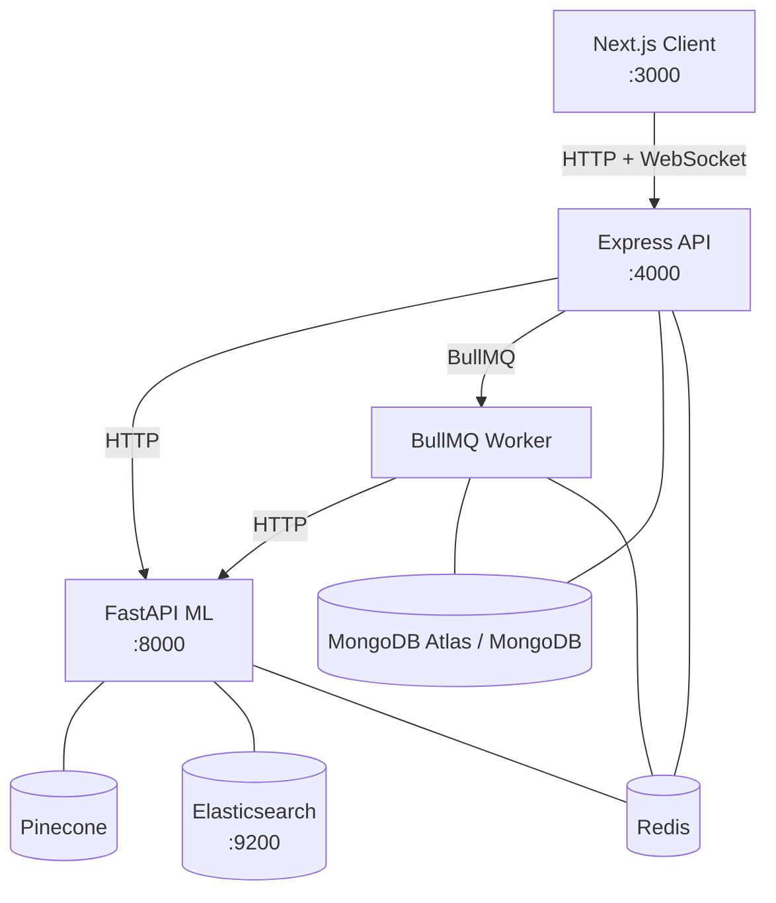

# Veridex

> AI-powered real-time claim verification and media intelligence platform.

## What It Does

Veridex ingests articles, PDFs, transcripts, posts, and raw text, decomposes them into atomic factual claims, retrieves supporting and contradicting evidence, verifies each claim, detects manipulation tactics, and produces a calibrated credibility score. It is built for live analysis: the frontend receives extraction, retrieval, verdict, manipulation, and scoring events over Socket.IO while the worker runs the long-running pipeline.

The system is intentionally engineered as a production-style monorepo rather than a demo. Authentication, rate limiting, refresh tokens, dead-letter handling, Redis-backed queues, MongoDB persistence, hybrid retrieval, evaluation datasets, and benchmark scripts are all included so the project can be operated, measured, and improved.

## Architecture



## Tech Stack

| Layer | Technology | Purpose |
| --- | --- | --- |
| Client | Next.js 14, React, Tailwind CSS | Forensic dashboard UI |
| Client state | Zustand, TanStack Query | Auth/session state and API caching |
| Realtime | Socket.IO, Redis pub/sub | Live pipeline events from worker to browser |
| API | Express, TypeScript | Auth, routing, orchestration, ownership checks |
| Auth | JWT, bcrypt, httpOnly refresh cookies | Access control and session rotation |
| Queueing | BullMQ, Redis | Ingestion, verification, and dead-letter jobs |
| Persistence | MongoDB, Mongoose | Users, documents, analyses, logs |
| ML service | FastAPI, Pydantic | Python-native inference endpoints |
| Claim extraction | OpenAI, spaCy, sentence-transformers | Classification, atomic claims, entities, embeddings |
| Retrieval | Pinecone, Elasticsearch, RRF, cross-encoder | Hybrid evidence search and reranking |
| Verification | GPT-4o, NLI, temporal/numerical checks | Verdicts and evidence sufficiency |
| Evaluation | Python scripts, JSON datasets | Extraction, retrieval, verification, manipulation, latency benchmarks |
| Deployment | Docker Compose, GitHub Actions | Local orchestration and CI |

## Quick Start

### Prerequisites

- Docker + Docker Compose
- Node.js 20+
- Python 3.11+
- Accounts/keys: MongoDB Atlas or local MongoDB, Pinecone, OpenAI

### 1. Clone and Configure

```bash
git clone https://github.com/DevaanshKathuria/Veridex
cd Veridex
cp .env.example .env
# Fill in all values in .env
```

For Docker Compose, keep service URLs pointed at Compose hostnames such as `mongodb`, `redis`, `ml`, and `elasticsearch`. For host-local development, use `localhost` equivalents.

### 2. Start All Services

```bash
docker-compose up --build
```

Health checks:

```bash
curl http://localhost:4000/health
curl http://localhost:8000/health
```

### 3. Seed the Knowledge Base

```bash
docker-compose exec worker npx ts-node scripts/seedKnowledgeBase.ts
```

### 4. Run Evaluation

```bash
cd evaluation/scripts
python eval_extraction.py
python eval_retrieval.py
python eval_verification.py
python eval_manipulation.py
python eval_latency.py
python ../ablation/run_ablation.py
```

## Environment Variables

| Variable | Service | Description | Example |
| --- | --- | --- | --- |
| `PORT` | API | API listen port | `4000` |
| `MONGODB_URI` | API, Worker | MongoDB connection string | `mongodb://mongodb:27017/veridex` |
| `REDIS_URL` | API, Worker, ML | Redis connection string | `redis://redis:6379` |
| `JWT_ACCESS_SECRET` | API | JWT access token signing secret | `replace_with_32_chars` |
| `JWT_REFRESH_SECRET` | API | Refresh-token secret/future rotation key | `replace_with_32_chars` |
| `CLIENT_URL` | API | Browser origin for CORS/socket.io | `http://localhost:3000` |
| `NEXT_PUBLIC_API_URL` | Client | Public API base URL used by browser | `http://localhost:4000` |
| `ML_SERVICE_URL` | API, Worker | Internal ML service URL | `http://ml:8000` |
| `WORKER_CONCURRENCY` | Worker | BullMQ worker concurrency | `3` |
| `ALERT_WEBHOOK` | Worker | Optional dead-letter alert webhook | `https://hooks.slack.com/...` |
| `ADMIN_EMAILS` | API | Comma-separated admin allowlist | `admin@example.com` |
| `REDIS_RATE_LIMITER` | API | `memory` for local, `redis` for shared rate limiting | `memory` |
| `NODE_ENV` | API, Worker, Client | Runtime environment | `development` |
| `OPENAI_API_KEY` | ML | OpenAI API key | `sk-...` |
| `PINECONE_API_KEY` | ML, Worker seed | Pinecone API key | `pcsk_...` |
| `PINECONE_INDEX_NAME` | ML, Worker seed | Pinecone index name | `veridex-kb` |
| `PINECONE_ENVIRONMENT` | Worker seed | Pinecone environment, if required by SDK/account | `us-east-1` |
| `ELASTICSEARCH_URL` | ML, Worker seed | Elasticsearch URL | `http://elasticsearch:9200` |
| `PIPELINE_VERSION` | ML | Version string surfaced by `/health` | `1.0.0` |

## API Reference

| Method | Route | Auth | Description |
| --- | --- | --- | --- |
| `GET` | `/health` | No | API and MongoDB health |
| `GET` | `/api` | No | API root metadata |
| `POST` | `/api/auth/register` | No | Create account and set refresh cookie |
| `POST` | `/api/auth/login` | No | Login and rotate refresh token |
| `POST` | `/api/auth/refresh` | Cookie | Issue a new access token |
| `POST` | `/api/auth/logout` | Cookie | Delete refresh token and clear cookie |
| `GET` | `/api/auth/me` | Bearer | Current user profile |
| `POST` | `/api/ingest` | Bearer | Ingest text, URL, PDF, transcript, tweet, or product text |
| `POST` | `/api/analyze` | Bearer | Create analysis and enqueue verification |
| `GET` | `/api/documents` | Bearer | Paginated user documents |
| `GET` | `/api/documents/:id` | Bearer | Full owned document |
| `GET` | `/api/documents/:id/status` | Bearer | Document readiness and counts |
| `DELETE` | `/api/documents/:id` | Bearer | Delete document and related analyses |
| `GET` | `/api/analyses` | Bearer | Paginated analyses |
| `GET` | `/api/analyses/:id` | Bearer | Full analysis report |
| `GET` | `/api/analyses/:id/share` | No | Public read for completed analysis |
| `DELETE` | `/api/analyses/:id` | Bearer | Delete owned analysis |
| `GET` | `/api/stats` | Bearer | User aggregate stats |
| `GET` | `/api/metrics` | Admin | System performance metrics |
| `POST` | `/api/admin/requeue/:jobId` | Admin | Requeue a dead-lettered job |

## Pipeline Overview

1. **Input**: The API validates text, URL, or upload input and creates a `Document`.
2. **Extract**: The ML service cleans text, segments sentences, and extracts atomic factual claims.
3. **Retrieve**: Pinecone dense search and Elasticsearch BM25 search are fused with RRF and reranked.
4. **Verify**: GPT/NLI/temporal/numerical checks produce per-claim verdicts and evidence.
5. **Score**: Manipulation tactics and verdict distributions produce a credibility score and summary.

## Evaluation Results

Current retrieval ablation from [benchmark_report.md](evaluation/results/benchmark_report.md):

| Strategy | Recall@5 | MRR | nDCG@5 | Verify Acc |
| --- | ---: | ---: | ---: | ---: |
| dense_only | 0.667 | 0.298 | 0.398 | 1.00 |
| bm25_only | 0.900 | 0.783 | 0.814 | 1.00 |
| hybrid | 1.000 | 0.867 | 0.914 | 1.00 |
| hybrid_reranked | 1.000 | 1.000 | 1.000 | 1.00 |

The local benchmark run used deterministic fixture fallbacks because the host Python interpreter lacked ML dependencies. In the ML container/runtime, the same scripts call the real pipeline.

## Project Structure

```text
Veridex/
  api/          Express API, auth, routes, socket bridge, Mongoose models
  worker/       BullMQ jobs, dead-letter handling, knowledge-base seeding
  ml/           FastAPI service and ML pipelines
  client/       Next.js dashboard and realtime analysis UI
  evaluation/   Curated datasets, evaluators, ablations, benchmark results
  docs/         Architecture and design decision documents
  docker-compose.yml
  .env.example
```

## Deploy-Ready Checklist

- `docker-compose up --build` starts MongoDB, Redis, Elasticsearch, ML, API, Worker, and Client.
- `/health` on API and ML returns healthy responses.
- Auth, ingest, analyze, realtime socket events, and scoring complete end-to-end.
- Evaluation scripts run from `evaluation/scripts`.
- Knowledge base seed script runs from the worker service.
- TypeScript and Python compile checks pass in CI.
