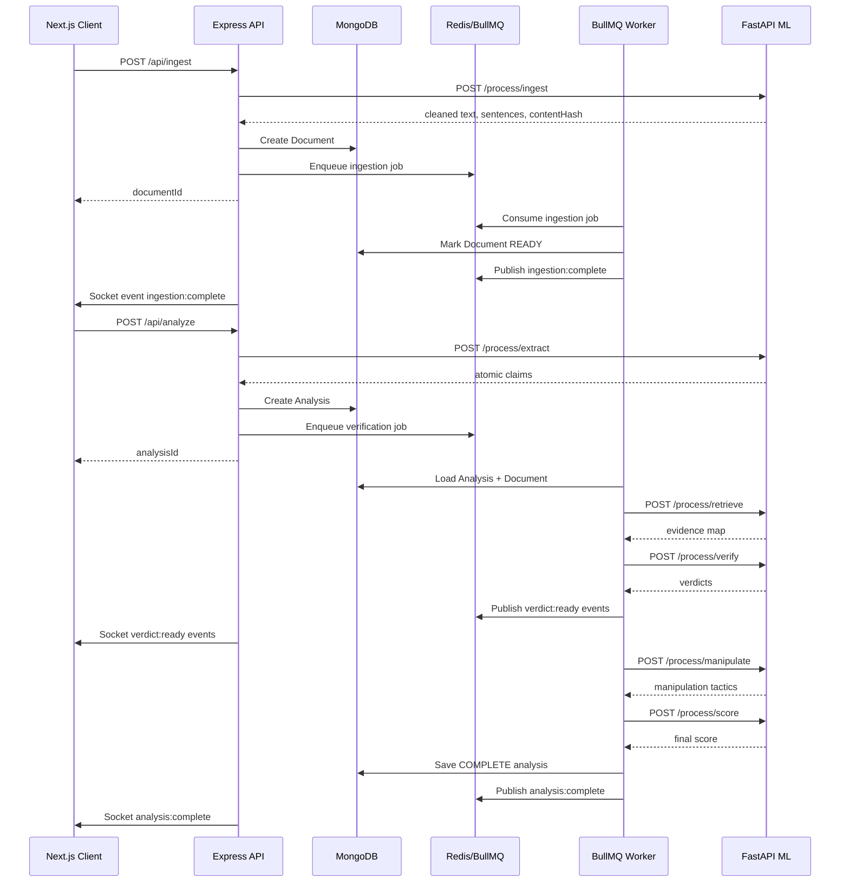
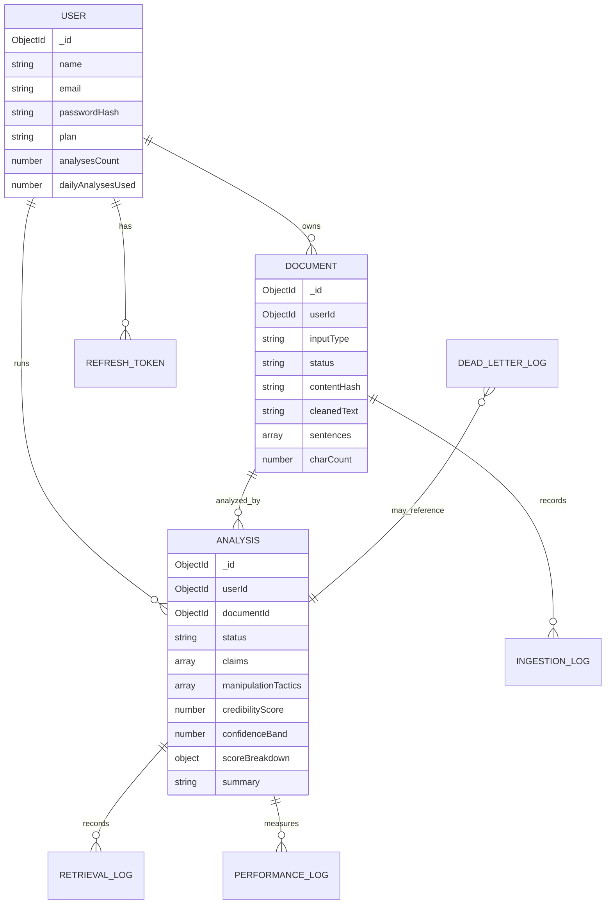
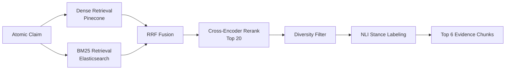

# System Architecture

Veridex is a service-oriented monorepo. The API owns user-facing contracts and persistence, the worker owns long-running jobs, the ML service owns inference, and the client renders the realtime investigation workflow.

## Service Communication

## Data Flow

1. The user submits text, a URL, or a file from the client.
2. The API authenticates the user, validates input, and asks the ML service to normalize/segment content.
3. The API stores a `Document` and enqueues background processing in BullMQ.
4. The user starts analysis; the API checks ownership, plan limits, document readiness, and seeds an `Analysis` with extracted claims.
5. The worker retrieves evidence for every claim using hybrid retrieval.
6. The worker asks the ML service to verify claims with evidence, temporal reasoning, and numerical checks.
7. The worker emits realtime claim verdict events through Redis pub/sub and Socket.IO.
8. Manipulation detection and credibility scoring run after verification.
9. The final `Analysis` embeds claims, evidence, manipulation tactics, score breakdown, and summary for a single-read report.

## MongoDB Schema

## Retrieval Pipeline

## Runtime Responsibilities

| Service | Responsibilities |
| --- | --- |
| Client | Auth screens, analysis workspace, dashboards, document management, realtime rendering |
| API | Auth, validation, ownership, plan limits, route contracts, queue enqueueing, socket bridge |
| Worker | Ingestion finalization, retrieval/verification orchestration, performance logs, dead letters |
| ML | Text processing, extraction, retrieval, verification, manipulation detection, scoring |
| Redis | BullMQ queues, cache, socket event pub/sub |
| MongoDB | Durable product data and analysis reports |
| Pinecone/Elasticsearch | Evidence retrieval indexes |
